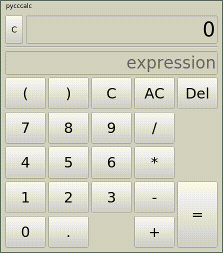

# PyCCCalc
Simple calculator.

# Features
- Math parser
- Graphical user interface
- Custom predefined variables
- Custom predefined functions

# Requirements
- Python
- PyQt5
- pyperclip

`pip install -r requirements.txt --user`

# Run
`python -m pycccalc` or `./pycccalc.py`
